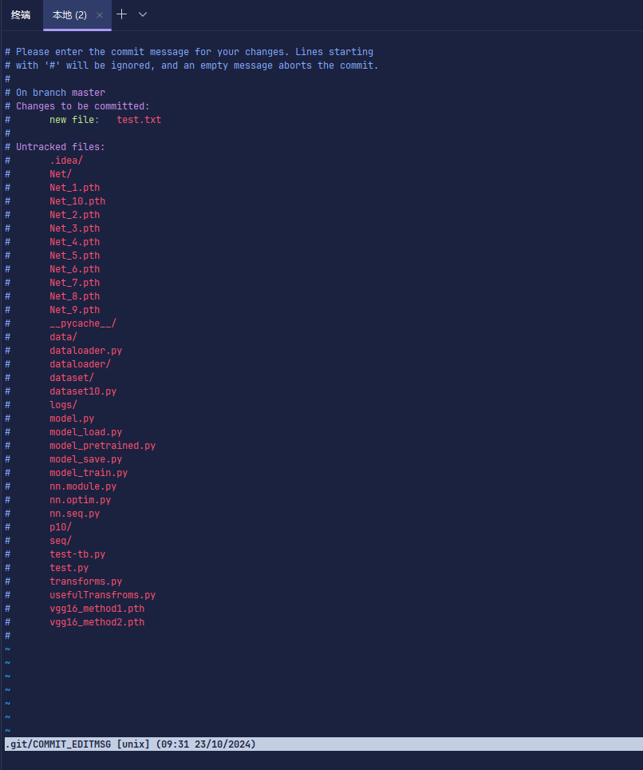
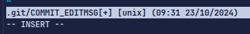
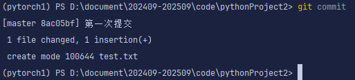
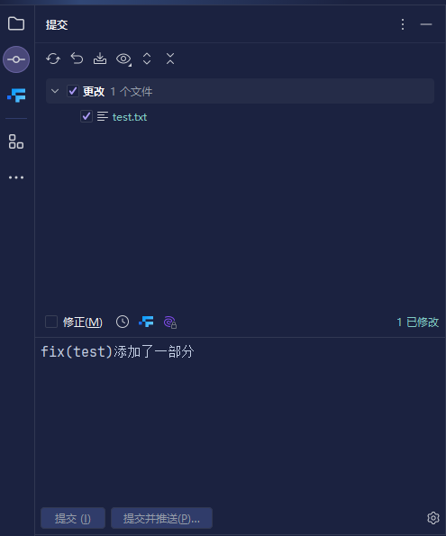
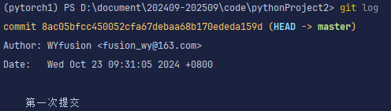
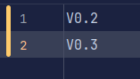
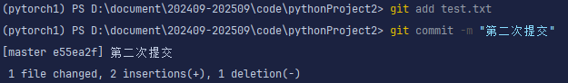

# Git

假设初始文本为：

#### 查询打开当前目录

```bash
pwd
```

#### 显示目录下所有文件

```bash
ls
```

#### 控制目录层

```bash
cd
```

##### 返回上一级目录

```bash
cd ..
```

##### 进入下一级目录

```bash
cd ./pythonproject2
```

#### 查看git版本

```bash
git version
```

#### 设置全局用户名与邮箱

```bash
git config --global user.name "WYfusion"
```

```bash
git config --global user.email "fusion_wy@163.com"
```

##### ==注意不同账户下进行版本控制需要将目录送入安全模式==

```bash
git config --global --add safe.directory D:/document/202409-202509/code/pythonProject2
```

#### 初始化当前目录的git。会创建一个.git的隐藏文件夹

```bash
git init
```

#### 添加文件进入暂存区，此时并没有保存提交记录

```bash
git add test.py
```

##### 添加目录下所有文件

```bash
git add .
```

#### 将暂存区中的文件提交为一个版本

```bash
git commit
```

将会进入此界面



不必惊慌。在$\#$的第一行上面添加你想添加的提交描述。使用英文输入法按下$a$和$i$进入编辑模式，用$esc$键退出编辑模式

编辑模式下在最后一行会有提示词：: —— INSERT ——

$esc$键退出后就和初始一样没有此提示符了。

```bash
第一次提交
# Please enter the commit message for your changes. Lines starting
# with '#' will be ignored, and an empty message aborts the commit.
#
# On branch master
# Changes to be committed:
#       new file:   test.txt
```

这里使用$ctrl+ins$键复制、$shift+ins$键粘贴。当然也可以用常规粘贴，如果在Git Bash命令行则只能用前者

- 键入完成提交描述后，按下$esc$键退出编辑模式，再按下英文输入法下的冒号键$:$

- 再使用$wq$命令，含义是写入保存并退出$(write,\ quit)$。再回车就到了原来熟悉的终端界面了。

##### 快捷提交方式

```bash
git commit -m "第二次提交"
```

这种方式会跳过刚才的$vim$界面直接进行提交说明

##### 自带提交方式

使用左边条中的提交



点击所修改的文件，会显示当前和之前的文件区别，勾选需要提交的文件，在下方文本框中输入提交说明并提交。

#### 查看提交日志

```bash
git log
```



1. 提交$id$唯一标识
2. 提交作者信息
3. 提交日期信息
4. 提交描述说明

#### 文本增加、修改后


对文本增加后，会在代码编辑区的侧面多一个亮绿的条，这个条表示新增

对文本修改后，会在代码编辑区的侧面多一个橙黄的条，这个条表示修改，一个改变，插入了两行，删除了一行。

