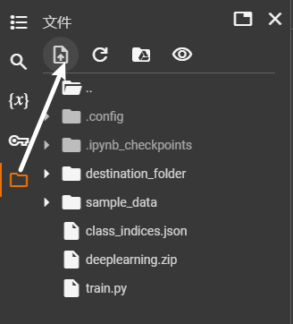

# Google colab

[欢迎使用 Colaboratory - Colab](https://colab.research.google.com/)

将项目压缩后通过左上方的**上传文件**的方式至colab中



等待左下方上传进度圆环**上传完毕**

然后使用命令：

```python
import zipfile

# 打开压缩包文件
with zipfile.ZipFile('/content/deeplearning.zip', 'r') as zip_ref:
    # 解压到指定文件夹
    zip_ref.extractall('destination_folder')
```

解压上传的文件。

$destination\_folder$是后要放在哪个文件夹里

$/content/deeplearning.zip$是待解压文件路径。路径获取方式为右键文件查询获取。

#### 使用以下Jurpyter命令打开至目标文件

```bash
ls				#显示当前目录下的所有文件、文件夹
```

```bash
cd /content/destination_folder/deeplearning		# 进入/content/destination_folder/deeplearning文件路径
```

一直到目标运行文件。

再使用以下命令运行

```bash
!python3 train.py
```

**注意**：这里的运行文件要使用相对路径

如果缺失了软件包(假设为adamp)，则使用以下命令

```bash
!pip install adamp
```


