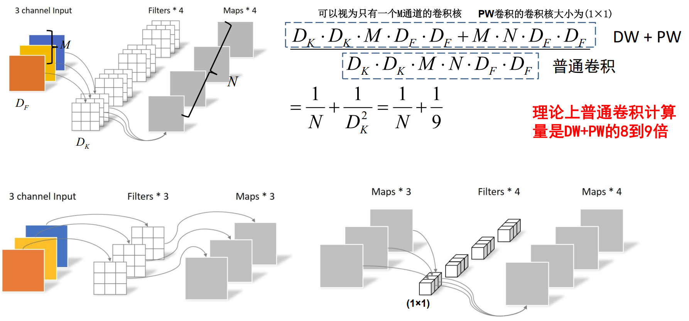

# 转置卷积

### 转置卷积步骤

1. 输入的特征图矩阵元素之间填充$stride-1$行和列的零元素
2. 输入的特征图矩阵元素外围填充$kernel\_size-padding-1$行和列的零元素
3. 将卷积核进行上下、左右对称翻转
4. 做步幅为1，填充为0的正常卷积运算

以下公式为**完整计算公式**的方法
$$
\begin{gathered}
H_{out}=(H_{in}-1)\times stride[0]-2\times padding[0]+dilation[0]\times(kernel\_size[0]-1)+output\_padding[0]+1 \\
W_{out}=(W_{in}-1)\times stride[1]-2\times padding[1]+dilation[1]\times(kernel\_size[1]-1)+output\_padding[1]+1 
\end{gathered}
$$
其中的$dilation和output\_padding$分别常常是$1和0$

以下公式为**常用计算长度**的方法：
$$
H_{out}=(H_{in}-1)\times stride[0]-2\times padding[0]+kernel\_size[0]\\W_{out}=(W_{in}-1)\times stride[1]-2\times padding[1]+kernel\_size[1]
$$

###### 举例解释：

### 卷积展开计算

尺寸计算
$$
\begin{array}{l}
{H_{out}} = \left[ {\frac{{{H_{in}} + 2 \times {\rm{padding}}[0] - {\rm{dilation}}[0] \times ({\rm{kernel size}}[0] - 1) - 1}}{{{\rm{stride}}[0]}} + 1} \right]\\
{W_{out}} = \left[ {\frac{{{W_{in}} + 2 \times {\rm{padding}}[1] - {\rm{dilation}}[1] \times ({\rm{kerne}}{{\rm{l}}_{\rm{s}}}{\rm{ize}}[1] - 1) - 1}}{{{\rm{stride}}[1]}} + 1} \right]
\end{array}
$$

一般情况下，$dilation$为0，公式也即：
$$
\begin{array}{l}
{H_{out}} = \left[ {\frac{{{H_{in}} + 2 \times {\rm{padding}}[0] - {\rm{kernel size}}[0]}}{{{\rm{stride}}[0]}} + 1} \right]\\
{W_{out}} = \left[ {\frac{{{W_{in}} + 2 \times {\rm{padding}}[1] - {\rm{kerne}}{{\rm{l}}_{\rm{s}}}{\rm{ize}}[1]}}{{{\rm{stride}}[1]}} + 1} \right]
\end{array}
$$

#### 单通道单核卷积

利用展平矩阵乘法的方式实现卷积

原本的常规卷积是平移、输入特征矩阵与卷积核各元素对应相乘再相加

___

1. 输入特征矩阵假设为$I:\ \ \begin{array}{|c|c|c|c|}\hline1&0&1&0\\\hline0&0&1&1\\\hline1&0&0&1\\\hline0&1&0&0\\\hline\end{array}$

2. 卷积核假设为$C:\ \ \begin{array}{|c|c|c|}\hline0&1&1\\\hline0&1&0\\\hline1&0&1\\\hline\end{array}$，为实现常规卷积中的移步的操作，可以进行以下操作：

可以对该卷积核的边缘填充为$1.1:\ \ \ \begin{array}{|c|c|c|c|}\hline0&1&1&0\\\hline0&1&0&0\\\hline1&0&1&0\\\hline0&0&0&0\\\hline\end{array}$、$1.2:\ \ \ \begin{array}{|c|c|c|c|}\hline0&0&1&1\\\hline0&0&1&0\\\hline0&1&0&1\\\hline0&0&0&0\\\hline\end{array}$、$2.1:\ \ \ \begin{array}{|c|c|c|c|}\hline0&0&0&0\\\hline0&1&1&0\\\hline0&1&0&0\\\hline1&0&1&0\\\hline\end{array}$、$2.2:\ \ \ \begin{array}{|c|c|c|c|}\hline0&0&0&0\\\hline0&0&1&1\\\hline0&0&1&0\\\hline0&1&0&1\\\hline\end{array}$

---

1. 对于输入特征矩阵**先按行后按列**进行**一维展平**变成一维行向量：$I^{1\times16}\begin{array}{|c|c|c|c|c|c|c|c|c|c|c|c|c|c|c|c|}\hline1&0&1&0&0&0&1&1&1&0&0&1&0&1&0&0\\\hline\end{array}$

2. 进一步我们再将对于卷积核扩展的四个矩阵**先按行后按列**进行**一维展平**变为4个列向量：$C^{16\times4}\begin{array}{|c|c|c|c|c|c|}\hline0&0&0&0\\\hline1&0&0&0\\\hline1&1&0&0\\\hline0&1&0&0\\\hline0&0&0&0\\\hline1&0&1&0\\\hline0&1&1&1\\\hline0&0&0&1\\\hline1&0&0&0\\\hline0&1&1&0\\\hline1&0&0&1\\\hline1&0&0&1\\\hline0&1&0&0\\\hline0&0&1&0\\\hline0&0&0&1\\\hline0&0&1&0\\\hline0&0&1&0\\\hline0&0&0&1\\\hline0&0&0&1\\\hline\end{array}$

这样使用矩阵乘法$I^{1\times16}C^{16\times4}=O^{1\times4}$对展开形式相乘即可。$(1,16)×(16,4)=(1,4)$,也即一维行向量：$O^{1\times4}:\ \ \begin{array}{|c|c|c|c|}\hline4&3&1&3\\\hline\end{array}$

再将$(1,4)$的输出矩阵重新还原为$(2,2)$的输出矩阵：$O:\ \ \begin{array}{|c|c|}\hline2&3\\\hline1&3\\\hline\end{array}$。

#### 多通道多核卷积

1. 将$C$个通道的特征图一维展开
2. $C$个对应通道的经过填充、一维展开后的$FN$个卷积核分别进行矩阵乘法。得到$(FN,C)$个一维列向量，将这$C$个一维行向量相加为$FN$个一维行向量。
3. 这$FN$个一维行向量加相同偏置(可能没有偏置)，就是输出的特征图矩阵，通道数为$FN$，也即卷积核个数

## 卷积的好处

可以通过卷积过程实现多个输入特征图通道的跨通道交互与信息整合(因为涉及相加求和了)(牵强)

##### 卷积的参数

参数量的计算公式只考虑以下因素：

- **卷积核的大小**（高度 $k_h$、宽度 $k_w$）
- **输入通道数** $C_{in}$
- **输出通道数** $C_{out}$

$$
参数量=(k_h×k_w×C_{in}+1)×C_{out}
$$

其中$+1$是只在有偏置时会加上输出通道个数

##### 卷积的计算量

卷积操作的计算量主要依赖于**输入特征图的尺寸**、**卷积核的大小**、**输入通道数**、**输出通道数**
$$
计算量=H_{out}×W_{out}×C_{out}×(k_h×k_w)×C_{in}
$$

### 转置卷积展开计算

$C^{T}:\begin{array}{|c|c|c|c|c|c|c|c|c|c|c|c|c|c|c|c|c|c|c|}\hline0&1&1&0&0&1&0&0&1&0&1&0&0&0&0&0\\\hline0&0&1&1&0&0&1&0&0&1&0&1&0&0&0&0\\\hline0&0&0&0&0&1&1&0&0&1&0&0&1&0&1&0\\\hline0&0&0&0&0&0&1&1&0&0&1&0&0&1&0&1\\\hline\end{array}\ \ \ \ C^{T}为(4\times16)$

- #### 矩阵计算过程

1. 对于$C^{T}$中的列向量进行合并为$(2\times2)$的$16$个矩阵							

​						$\begin{equation}\begin{aligned}
&\begin{array}{|l|l|}
\hline 0 & 0 \\
\hline 0 & 0 \\
\hline
\end{array}
&\begin{array}{|l|l|}
\hline 1 & 0 \\
\hline 0 & 0 \\
\hline
\end{array}\ \ \ \ \ \ \ \ 
&\begin{array}{|l|l|}
\hline 1 & 1 \\
\hline 0 & 0 \\
\hline
\end{array}
&\begin{array}{|l|l|}
\hline 0 & 1 \\
\hline 0 & 0 \\
\hline
\end{array}\\
&\begin{array}{|l|l|}
\hline 0 & 0 \\
\hline 0 & 0 \\
\hline
\end{array}
&\begin{array}{|l|l|}
\hline 1 & 0 \\
\hline 1 & 0 \\
\hline
\end{array}\ \ \ \ \ \ \ \
&\begin{array}{|l|l|}
\hline 0 & 1 \\
\hline 1 & 1 \\
\hline
\end{array}
&\begin{array}{|l|l|}
\hline 0 & 0 \\
\hline 0 & 1 \\
\hline
\end{array}\\
&\begin{array}{|l|l|}
\hline 1 & 0 \\
\hline 0 & 0 \\
\hline
\end{array}
&\begin{array}{|l|l|}
\hline 0 & 1 \\
\hline 1 & 0 \\
\hline
\end{array}\ \ \ \ \ \ \ \
&\begin{array}{|l|l|}
\hline 1 & 0 \\
\hline 0 & 1 \\
\hline
\end{array}
&\begin{array}{|l|l|}
\hline 0 & 1 \\
\hline 0 & 0 \\
\hline
\end{array}\\
&\begin{array}{|l|l|}
\hline 0 & 0 \\
\hline 1 & 0 \\
\hline
\end{array}
&\begin{array}{|l|l|}
\hline 0 & 0 \\
\hline 0 & 1 \\
\hline
\end{array}\ \ \ \ \ \ \ \
&\begin{array}{|l|l|}
\hline 0 & 0 \\
\hline 1 & 0 \\
\hline
\end{array}
&\begin{array}{|l|l|}
\hline 0 & 0 \\
\hline 0 & 1 \\
\hline
\end{array}
\end{aligned}
\end{equation}$

2. 再用卷积结果得到的$(2\times2)$输出矩阵$\begin{array}{|c|c|}\hline2&3\\\hline1&3\\\hline\end{array}$与1.中的16个$(2\times2)$矩阵进行矩阵乘法，得到16个数构成的一维行向量

​					$\begin{array}{|c|c|c|c|c|c|c|c|c|c|c|c|c|c|c|c|}\hline0&2&5&3&0&3&7&3&2&4&5&3&1&3&1&3\\\hline\end{array}$

___

- #### 展开计算过程

​	可以使用$O^{1\times4}C^{T}=P^{1\times16}$,来获取与常规转置中输入特征矩阵展开后的一维行向量一样长度的$P$行向量，再对行向量还原成$(4\times4)$矩阵。

​	注意：$C$依旧是卷积过程中相同的卷积核，$C^{T}$只是对其进行了转置。$O$也是展开计算过程的输出一维行向量。

### 转置卷积计算

也即开头中的4个步骤：

1. 2.转置卷积的输入，也即正常卷积的输出矩阵经过行列与边缘填充后$\begin{array}{|c|c|c|c|c|c|}\hline0&0&0&0&0&0\\\hline0&0&2&3&0&0\\\hline0&0&1&3&0&0\\\hline0&0&0&0&0&0\\\hline0&0&0&0&0&0\\\hline\end{array}$

   这里的$stride=1$则行列内填充为$stride-1=0$

   $kernel\_size=3,padding=0$，则矩阵外填充$kernel\_size-padding-1=2$

3. 使用$C$卷积核$\begin{array}{|c|c|c|}\hline0&1&1\\\hline0&1&0\\\hline1&0&1\\\hline\end{array}$的行、列互换后的矩阵$\begin{array}{|c|c|c|}\hline1&0&1\\\hline0&1&0\\\hline1&1&0\\\hline\end{array}$

4. 做步幅为1，填充为0的正常卷积运算。

### 分组卷积

在分组卷积中，输入通道进行分组后，卷积核也进行相应分组，且**两个类别的组数相同**、关系是**一一对应**。

在卷积过程中，卷积核只会与**对应输入通道组别**对应的通道进行卷积运算。

也即一组的卷积核中，只会选择该组的一部分通道与对应的输入通道分组中相应通道进行卷积。卷积分组中其他部分的通道不再进行卷积运算。

- 卷积核个数也依旧是输出通道个数
- 输入通道个数也依旧等于卷积核通道个数

分组卷积在pytorch中的使用方法与一般卷积相比多了个$groups$参数，这个$groups$的个数就是分组的个数。

### $DE$深度卷积$(Depthwise\ Conv)$

- 卷积核的$channel$为1
- 输出特征矩阵$channel$=卷积核个数=输出特征矩阵$channel$

### PW逐点卷积$(Pointwise\ Conv)$

- 普通的卷积
- 卷积核大小为1

控制输出通道的个数

### 深度可分卷积$Depthwise\ Separable\ Conv$

是由$DW$和$PW$卷积一起构成的，下图上半部分为传统卷积、下半部分是深度可分卷积。体现了计算量上的减少。

