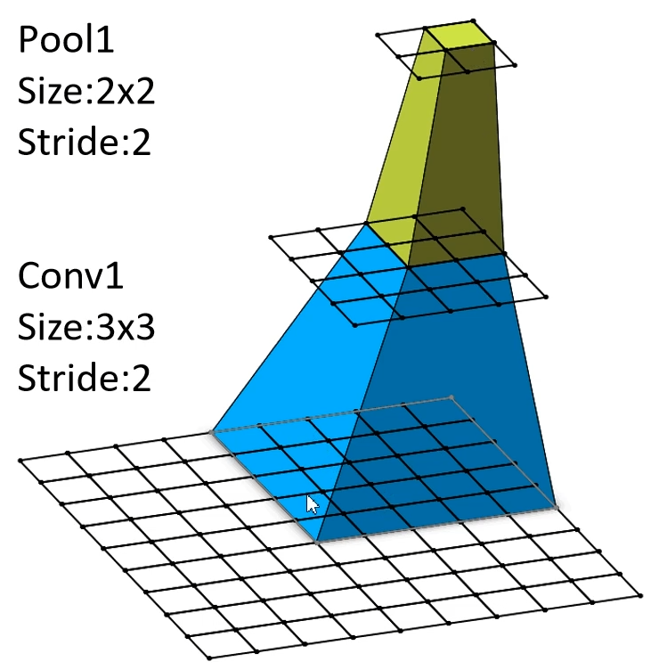

# CNN感受野

CNN中特征图的一个元素对应于之前某层扫过范围的子矩阵范围大小

**感受野计算公式**

$F(i)=(F(i+1)-1)\times Stride+Ksize$

1. $F(i)$是第$i$层的感受野
2. $Stride$为第$i$层的步距
3. $Ksize$为第$i$层卷积核或者池化层的尺寸

取最上层中特征图的一个元素，则有$\begin{aligned}\mathsf{Pool1:}\quad&\mathsf{F=(1-1)\times2+2=2}\\\mathsf{Conv1:}\quad&\mathsf{F=(2-1)\times2+3=5}\end{aligned}$   其中算得的$2、5$分别是池化、卷积层的感受野尺寸(方形)

---

#### 可以使用$3$层$(3\times3)$的步距为1的卷积核可以实现一个$(7\times7)$的卷积核

$$
\begin{aligned}\mathsf{Conv3\times3(3):}\quad&\mathsf{F=(1-1)\times1+3=3}
\\\mathsf{Conv3\times3(3):}\quad&\mathsf{F=(3-1)\times1+3=5}
\\\mathsf{Conv3\times3(3):}\quad&\mathsf{F=(5-1)\times1+3=7}\end{aligned}
$$

这样可以减少参数

使用$7\times7$卷积核所需参数，与堆叠三个$3\times3$卷积核所需参数(假设输入输出channel为$C$，交叉对应所以为$C^2$)
$$
7\times7×C×C=49C^2\\\mathsf
3\times3×C×C+3\times3×C×C+3\times3×C×C=27C^2
$$
